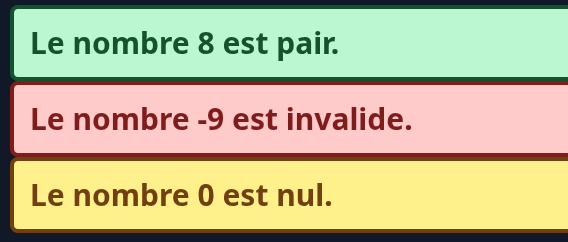

# Atelier 2 - Langage PHP

> ⚠️ **Rappel**: Désactivez les suggestions en ligne de votre IA pour PHP

## Numéro 1

Créer trois fonctions suivantes:

 * nomComplet, reçoit nom et prénom en paramètre et retourne le nom complet \
 Exemple: nomComplet("Girard", "Philippe") retourne "Philippe Girard"
 * estMajeur, reçoit un âge (nombre entier) en paramètre et retourne un booléen qui indique si la personne est majeure \
 Exemple: estMajeur(19) retourne true
 * plusGrand, reçoit un nombre inconnue de nombres et retourne le plus grand nombre de cette liste, n'utilisez pas la fonction PHP max \
 Exemple: plusGrand(0, 42, 9001) retourne 9001

Testez chacune de ces fonctions et affichez les résultats avec des 'echo'

## Numéro 2

Explication préléminaire:

 * PGCD: Plus Grand Commun Diviseur. Entre 2 nombres, trouver le plus grand entier qui permet de les diviser sans restes. Donc n1 / x = a et n2 / x = b, trouver x (tous doivent être des entiers). Avec 8 et 6 le PGCD est 2 (8 / 2 = 4 et 6 / 2 = 3) et avec 16 et 24 c'est 8 (16 / 8 = 2 et 24 / 8 = 3).
 * PPCM: Plus Petit Commun Multiple. Avec 2 nombres, trouver le plus petit multiple commun (avec des entiers). Donc n1 * a = x et n2 * b = x, trouver x (tous doivent être des entiers). Avec 16 et 20 le PPCM est 80 (16 * 5 = 80 et 20 * 4 = 80).

Ce que vous devez faire:

 1. Écrire deux fonctions, une qui calcul le PGCD et une qui calcul le PPCM.
 2. Choisir 2 nombres aléatoire entre 1 et 100 (fonction PHP `rand(min, max)` ) et calculer leur PGCD et leur PPCM
 3. Afficher avec des echo les résultats ( "PGCD de x et y est ?" et "PPCM de x et y est ?")

## Numéro 3

Générez un nombre aléatoire entre -10 et 10 et selon le nombre trouvé changez le PHP (ne pas echo de HTML, mais vous pouvez echo des valeurs). Assurez-vous que le HTML généré respecte les règles A11Y de constraste avec ce site: https://webaim.org/resources/contrastchecker/

 * Nombre plus petit que 0: Afficher une boîte rouge qui indique que le nombre est invalide
 * Nombre plus grand que 0: Afficher une boîte verte qui indique si le nombre est pair ou non
 * Nombre égal à 0: Afficher une boîte jaune qui indique que le nombre est nul

