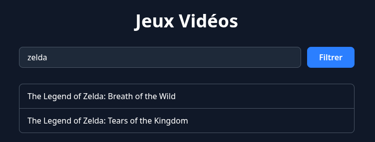
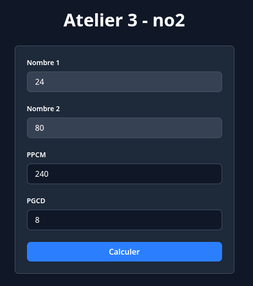
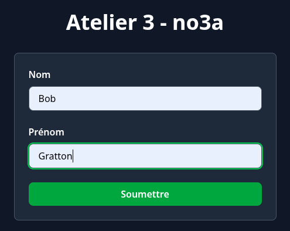
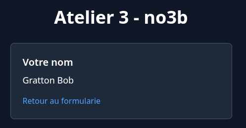

# Atelier 3 - Superglobales PHP

## Numéro 1

Dans un fichier PHP, créez un tableau contenant au moins 10 chaînes de caractères.

Dans le HTML de ce fichier, affichez:

 * Un formulaire de recherche (champ texte et bouton)
 * La liste des chaînes dans une liste non ordonnée

Le formulaire fonctionne en GET. Lorsque je fais une recherche, affichez seulement les éléments qui contiennent le texte cherché. S'il n'y a pas de recherche en cours, affichez tous les éléments. Si la recherche ne retourne aucun résultat, affichez un message.

## Numéro 2

Récupérez votre numéro de PGCD et PPCM de l'atelier précédent. Ajoutez un formulaire HTML qui demande les deux nombres et qui fonctionne en POST. Lorsque je soumet le formulaire:

 1. Affichez les deux résultats;
 2. Gardez les nombres envoyés dans le formulaire;

Les champs PPCM et PGCD sont en lectures seules et affichés seulement s'il y a des résultats. Pas besoin de gérer les erreurs (par exemple les nombres sont négatifs ou non entiers).

## Numéro 3

Ce numéro fonctionne avec 2 pages:

Page 1: Formulaire POST qui demande un nom et un prénom, envoie la requête à la page 2.

Page 2 : Affiche la concaténation du nom et prénom reçu de la page 1, ajoutez aussi un lien pour retourner à la page 1. Si on ne reçoit rien, redirigez vers la page 1.

