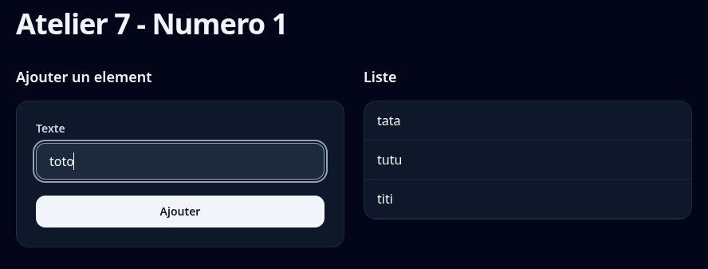
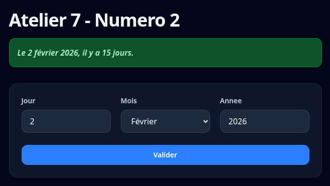

# Atelier 7

> ⚠️ **Important:** Désactivez l'auto-complétion JavaScript (Copilot, IntelliSense, etc.) pour cet atelier. Le but est de pratiquer par vous-même!

## Numéro 1

 * Dans une première section, faire un formulaire qui demande un texte (requis)
 * Lorsqu'on soumet le formulaire (enter ou clique sur le bouton):
   * Ajouter le texte en tant que nouvel élément dans la liste
   * Vider le champ texte
 * Dans la deuxième section, afficher les textes ajoutés dans une liste
 * Lorsqu'on clique sur un élément de la liste, le retirer de la liste

## Numéro 2

 * Utilisez day.js ou l'objet Date de JavaScript
 * Créez le formulaire ci-dessous:
   * Jour: obligatoire, nombre entre 1 et 31
   * Mois: obligatoire, dropdown (select) du mois
   * Année: obligatoire, nombre entre 1900 et l'année courante
 * Si la date n'est pas valide, afficher une boîte rouge contenant un message d'erreur simple
   * Gérez le cas où un utilisateur 'hack' la validation HTML et écrit des lettres au lieu d'un chiffre (day.js a une fonction pour voir si la date est valide)
   * Gérez aussi le cas où l'utilisateur entre le 30 février, la date n'est pas valide mais aucun outil ne fera d'erreur (il va afficher le 2 mars par exemple)
 * Si la date est valide, afficher une boîte verte (changez les classes ou gérez un 2e div) contenant le texte:
   * La date en français
   * Combien de temps depuis cette date, pour ce point regardez la documentation https://day.js.org/docs/en/plugin/relative-time et inspirez-vous de l'inclusion du plugin localizedFormat pour l'inclusion du plugin relativeTime
   * Exemple: Le 27 janvier 2021, il y a 5 jours

