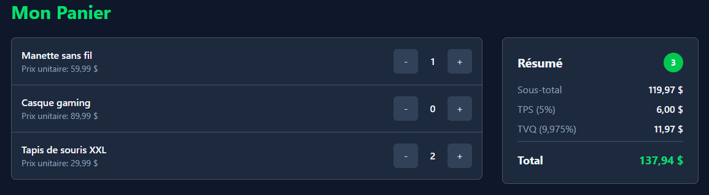

# Atelier 8

Faites une page HTML pure, qui va appeler une API.

Votre page affiche au moins 3 produits, chaque produit a un bouton '+' et un bouton '-' qui permet de modifier les quantités. Sur un clique de ces boutons, appelez une API PHP.

L'état actuelle du panier est conservé en PHP (pas de BD). Si une quantité est de zéro, ne gardez pas ce produit dans le panier sur le serveur.

L'API ajuste le panier, puis retourne tous les chiffres (quantités dans le panier, quantité totale, sous-total, TPS, TVQ et total). Votre JavaScript ajuste l'interface avec la réponse de l'API.

Faites quelques validations (pas de quantité négative, le produit doit exister, etc.).

