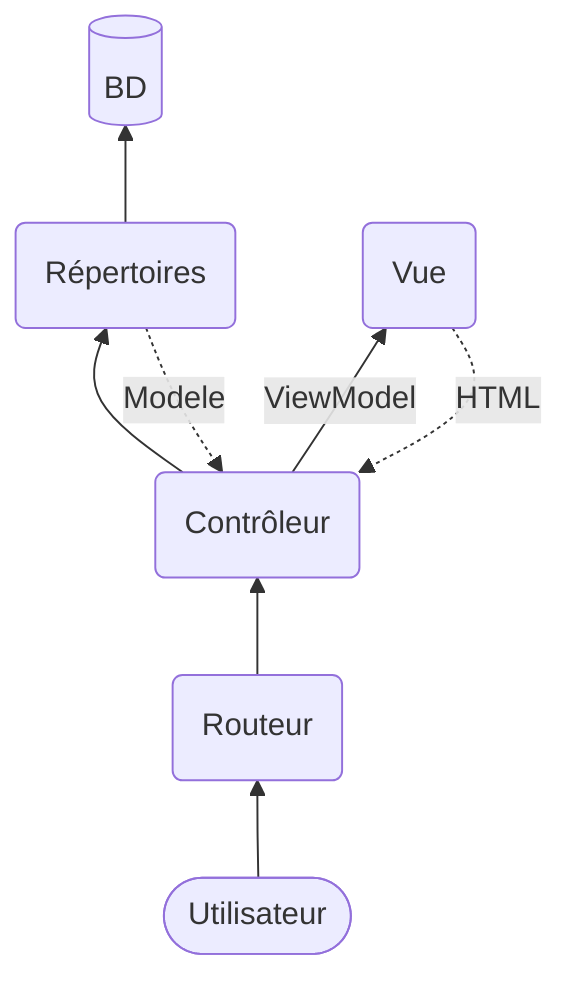

# MVC avancé

Les frameworks vont utiliser un modèle MVC plus avancé. Chaque framework peut modifier le modèle, mais habituellement ça ressemble au schéma suivant:

Chaque couche:

 * Routeur: Un seul fichier, le index.php. L'utilisateur va appeler la page "index.php?controller=user&action=list" pour avoir la liste des utilisateurs. Le fichier index.php va créer le contrôleur et appeler la bonne fonction du contrôleur. Avec un htaccess, vous pouvez aussi rediriger tous les appels vers le index.php et utiliser des URLS comme "/users/list" ce qui est plus beau que le index.php.
 * Contrôleur: Chaque contrôleur est habituellement lié à une table (mais pas nécessairement). Il a plusieurs fonctions, appelées "action". Donc l'action (fonction) list() du contrôleur (classe) "user" va lister tous les utilisateurs. Comme dans le modèle précédent, le contrôleur va s'occuper de faire le lien entre le Modèle et la Vue, de la sécurité, de la validation et de la session.
 * Modèle: Le modèle dans ce schéma est un simple conteneur de données (un DTO). Ça donne souvent des classes avec des propriétés, mais sans fonctions.
 * Répertoire (repository): Cette nouvelle couche s'occupe du SQL. Chaque table va (habituellement) avoir son répertoire. Chaque répertoire va définir les fonctions SQL utiles à l'application (SELECT de tout, SELECT de un ID, INSERT, DELETE, UPDATE). Les fonctions SELECT vont retourner un ou plusieurs modèle. Les fonctions INSERT et UPDATE vont recevoir des modèles en paramètre.
 * Vue: Cette couche ne change pas, elle s'occupe encore du frontend. Elle devrait avoir le minimum de logique possible, idéalement aucune.
 * ViewModel: Un DTO qui va servir aux Views. Au lieu d'envoyer et recevoir plusieurs paramètres, on va regrouper le tout dans des ViewModels. Ça va simplifier le typage dans vos views (au lieu d'avoir 10 variables à typer en haut de la vue, on en utilise juste 1 qui regroupe les 10). Les ViewModels sont très utilisés en ASP MVC, mais rarement en PHP.

Une couche n'est pas présente dans ce schéma: les *middlewares* ou couche intermédiaire. Un *middleware* sert à soulager les contrôleurs de la validation. Le contrôleur servirait donc seulement à gérer les données reçu et appeler la bonne vue.