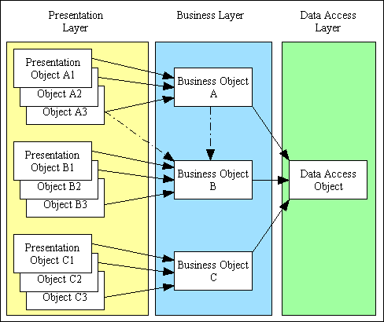
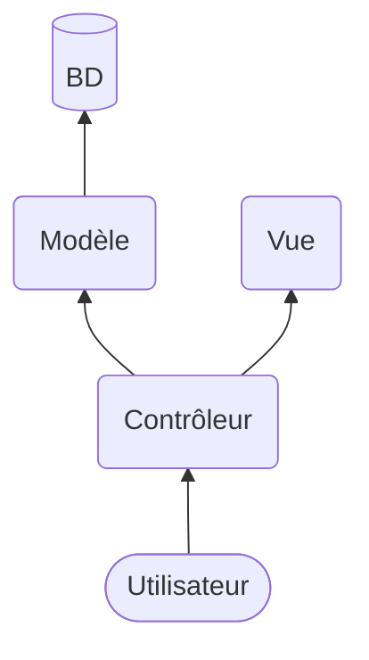

# MVC

Dans le monde du Web, les applications et frameworks sont structurés avec le modèle MVC. Les exceptions: Les API, les vielles applications et les scripts très simples.

Notez que mon livre de patrons de conception est barricadé au cégep, il ne veux pas de covid sur ses pages...

Le patron MVC est un dérivé du modèle n-tiers.

Source de l'image: https://www.tonymarston.net/php-mysql/3-tier-architecture.html

Le patron de conception n-tier sépare le logiciel en plusieurs couches. Chaque couche peut utiliser la couche suivante mais ne peut pas utiliser les autres (regardez les flèches dans l'image précédente). Très important, il ne faut pas créer de référence circulaire entre les couches! Idéalement chaque couche est "cachée" derrière des interfaces afin de remplacer facilement les éléments à l'intérieur de chaque couche.

## MVC simplifié

Le MVC est basé sur le modèle n-tier. Un MVC classique sur Internet va le présenter avec des références circulaires (chaque couche connais les deux autres). Par contre, nous allons utiliser un MVC simplifié qui évite les références circulaires:

 * M - Modèle: Le modèle s'occupe de l'interaction avec la base de donnée. Il ne devrait y avoir aucun SQL à l'extérieur de cette couche.
 * V - Vue: La vue s'occupe de l'affichage. Il ne devrait y avoir aucun HTML ni CSS à l'extérieur de cette couche.
 * C - Contrôleur: Le contrôleur va faire le lien entre le M et le V. Il va aussi s'occuper de la sécurité, de la validation et de la session. Donc, tout ce qui n'est pas SQL et Frontend va dans cette couche.

Parfois je vais créer une couche flottante "Outils" qui pourra servir à une ou plusieurs couche du MVC. Dans ce modèle simplifié, chaque contrôleur est un appel utilisateur. L'utilisateur va donc demander la page `controlleur/users/list.php` pour avoir la liste des utilisateurs. Ce n'est pas idéal, mais ça donne une structure très simple.

Les modèles et les vues vont être dans leur dossier correspondant (`models` et `views`). Mais les contrôleurs peuvent être dans le dossier racine, ou dans un dossier `controllers`. Le contrôleur de la page d'accueil devrait être `index.php`, ou ce fichier redirige vers le contrôleur de la page d'accueil.

