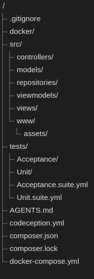
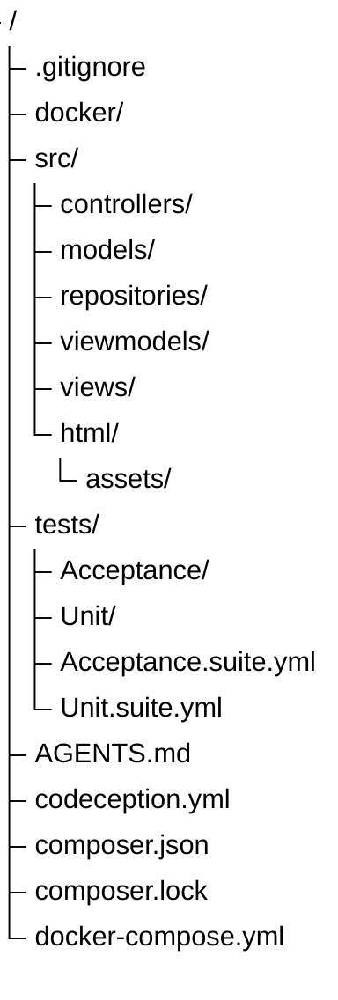

# Codeception

## Installation

On installe Codeception via Composer:

```
composer require "codeception/codeception" --dev
```

Vous n'êtes pas obligé d'installer les 2 modules composer suivants, le bootstrap de Codeception va les installer pour vous.

Pour les tests d'acceptation avec un navigateur sans interface (notez qu'un navigateur sans interface n'exécute pas le JS):

```
composer require codeception/module-phpbrowser --dev
```

Pour les tests unitaires, on installe le module d'assertions:

```
composer require codeception/module-asserts --dev
```

## Configuration

On génère la configuration pour les tests:

```
php vendor/bin/codecept bootstrap
```

Cette commande génère les tests d'acceptations, unitaires et fonctionnels. Nous n'allons pas utiliser les tests fonctionnels, supprimez le dossier `tests/Functional` et le fichier `tests/Functional.suite.yml`.

Dans le fichier `tests/Acceptance.suite.yml`, changez l'URL de PhpBrowser pour pointer vers le container web (nginx):

```yml
actor: AcceptanceTester
modules:
    enabled:
        - PhpBrowser:
            url: http://web
```

PhpBrowser est un navigateur sans interface, il ne peut pas exécuter du JavaScript. Nous pourrons donc seulement tester les fonctionnalités qui ne nécessitent pas de JavaScript.

Finalement, on construit les fonctions utilitaires pour les tests (étape optionnelle, le bootstrap semble le faire automatiquement):

```
php vendor/bin/codecept build
```

## Exécution des tests

Pour rouler tous les tests:

```
php vendor/bin/codecept run
```

Pour rouler seulement une suite (attention à la majuscule):

```
php vendor/bin/codecept run Acceptance
php vendor/bin/codecept run Unit
```

## Structure des dossiers

Afin de mieux séparer les tests du code, on va mettre tout le code dans un dossier `src`. Dans votre `docker-compose.yml`, vous devez aussi changer le volume pour que le code soit dans le dossier `src`:

```yml
volumes:
  - ./src:/var/www
```



Le preview Mermaid ne fonctionne pas pour le treeView, je l'ai donc généré manuellement, voici la syntaxe utilisée pour référence future:



